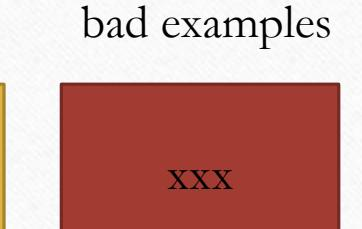

# **Project Presentation: Suggestions and Guidelines**

EE3070

Design Project

#### **Presentation**

- Presentation is not a demonstration
- It is to give an overall picture for the project, including your observations, ideas, efforts, solutions, etc.
- Aims to show
  - the identified problem and how to solve it
  - the distinct features of your design
  - your effort and talent
  - …

(in simple words, how good you and your design are!)

#### **Number of Slides**

- It depends on your paces.
- For a 10-minute presentation, the number of slides will be about 15, each takes about 30-40 seconds. [Again, it depends on your paces.]
- Timing is important
  - Rehearse to adjust your pace (but not too rush) or adjust your slides

#### **General Notes on Slide Preparation**

- Pick some backgrounds / slide design, but not too distractive ones
- Each slide contains some notes to help remembering the main points
  - No long paragraph
  - Not to read the notes, word by word
- Include suitable pictures / images to attract attention
- Beware of colors / fonts usage
- Check your spelling and grammar

*Difficult to read* Difficult to read

### **During Presentation**

- Don't just look at your slide and read out the text
- Try to have eye-contact with your audience
- If appropriate, provide suitable hand gestures to facilitate communications, eg. point to a main point in a slide.
- Keep a proper pace

## **Organization of Slides (ppt)**

#### **Organization**

- It is important to organize your slides to reflect a proper and logic flow.
- Generally (so, it is not a MUST), we have
  - 1. Title page
  - 2. Motivation / Identified Problems
  - 3. Methods / Solutions
  - 4. Outcomes / Results
  - 5. Conclusions / Highlights (take-home message)

#### **Project Title**

- Give a title that can reflect your project (Not simply EE3070 Design Project)
- Use 1-2 sentences to describe your presentation (these sentences may/may not be shown on slide)
  - E.g. This presentation reports our work on ….
  - You can add pictures to attract your audience

#### **Motivation / Identified Problem**

- Give the motivation and what the identified problem is.
- E.g.
  - What is the scenario?
  - Why is it needed to be solved?
  - Key items to be solved

#### **Methods / Solutions**

- Propose your solution to the audience
- Example: You may discuss
  - What are the main features / functions of your design?
  - How is it implemented? (Not the details, but an overview, say with block diagram)
  - How can it address the targeted problems?

#### **Outcomes / Results**

- Show audience the success of your design
- E.g. you may discuss
  - How is it used?
  - What is the output / outcomes?
  - Advantages
- Include some actual results

#### **Conclusions / Highlights**

- Conclude your work
- E.g. you may
  - Provide Highlights of your design as take-home message
  - Conclude your contributions/design in 1-2 sentences
  - Provide self-reflection